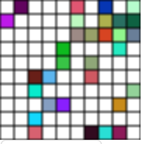

#Homework1---Game of Life 
#Technical Report

###name:guzhicheng
###number:2014013442 

* ##Goal:
		This program is aimed to simulate the life of game in the web browser and I mainly use JavaScript to develop the program.
		mocha and eslint testing are required
		
* ##Environment:
	* OS: Mac OS X El Capitan
	* Processor: 2.5GHz Intel Core i7
	* Memory: 16 GB 1600 MHz DDR3
	* IDE: sublime text 3
	* Language: JS and HTML
	* Dependencies:
		* chai 3.5.0
		* eslint 3.5.1
		* mocha 3.0.2
		
* ##Program Features
	* #####control cells color: pure black + random color
	* #####customize animation speed
	* #####control animation status(stop or run)
	* #####customize grid size
	* #####restart game
* ##Development Details
	* ###Creating the grid area for cells
		* The method I adopt to draw the whole picture in the browser is to 		use the `canvas` element provided by HTML5. Compared with div, 		canvas is quiet convinient as I don't have to create lots of div 
		for the cells.
		* The object `cellGrid` is used to draw grid
		* To draw the grid, I just simply use the member method of the canvas context called ** beginPath**, then call ** moveTo ** , ** lineTo ** and ** stroke ** to finish the line.
		* By calculating the distance between lines(say,` x of No.i vertical line should be i / lineNum * width` ), the program draws the vertical lines and horizontal lines on the screen respectively.
		following is code for drawing vertical lines
		
		```
			for(currentX = 0; currentX <= 	this.cellGridWidth; currentX += cellWidth)
			{
				ctx_render.beginPath();  
				ctx_render.moveTo(currentX, 0);  
				ctx_render.lineTo(currentX, this.cellGridHeight);  
				// 将这条线绘制到 canvas 上  
				ctx_render.stroke();
			} 
		```
		
	* ### Controlling the size of grid
		* The user can use the bars provided to control the width of the canvas and the height of the canvas respectively. To resize the canvas, the user has to restart the game.
	* ### Drawing the cells
		* To draw the cells, firstly, the program will check the corresponding value stored in `cellGrid`, which decides whether a certain position has a cell.
		* Then the Object `gameEngine` will call its member method called "renderAll". And the blocks where cells exist will be filled with color by calling ** fillRect(x,y,endx,endy)**.
		* The default color of the cells is black,  and user can choose a random color by clicking `color:random` button. In such circumstance, the program will fill the block by setting the fillStyle to the following value:
		
		```
		ctx_render.fillStyle = "#"+("00000"+((Math.random()*16777215+0.5)>>0).toString(16)).slice(-6);
		```
		Notice that there is an exception that the random color may be white(the same as the background), to avoid such situation, the program will change it to `black("#FFFFFF")` when nessary.
	* ### Determining the state of a cell
		* The `gameEngine` provide a member method called ** determineStateForBlock ** , and it will change the corresponding value in `cellGrid` after being called.
		* After getting the parameters `gridIndexX` and `gridIndexY` which indicate the position of the block, the function ** determineStateForBlock ** will check the `8 blocks' values in lastCellGrid` surrounding the target block and then count the cells and decide the state. The function uses a nested `for` and avoid counting the target block by an if statement.
	* ### Controlling the animation
		* The `gameEngine` will use two functions ** run ** and **stop ** to control the process.
		* The function ** run **  sets an interval to call **tick ** every certain period of time. When user changes the speed, the animaiton will accelerate or decelerate correspondly.
		* Addtionally, when users click start(stop) button, the interval will be created(cleared)
	* ### Restarting the game
		* the program simply stores the cell numbers on the `X axis and Y axis` respectively and then clear all elements on the screen. Then, the program will create a new canvas based on the values stored before and start the animation.
		
* ##Unit Test
	* ### Test the grid
		* To test the cellGrid and lastCellGrid, the central part is the function ** cellGridInit ** . By using mocha, we can ensure that cellGridInit is a function and have 2 arguments. And the function gurantees to generate a cellGrid and a lastCellGrid corresponding to the input.
		
		```
			Procedure:
			call cellGridInit(2,2)
			use assert.equal(Width(Height), 2) to test the grid size
			Result:
			cellGrid.length == 2
			cellGrid[0].length == 2(example guarantees that cellGrid[0] can be accessed)
			no alert, test passed!
		```
				
		* In addition, `lastCellGrid` is tested to gurantee that its size is equal to the `cellGrid` and it can record the previous value of cellGrid.
		
		```
			Procedure:
			use assert.equal(lastCellGrid[i][j], cellGrid[i][j]) to compare each value stored in cellGrid and lastCellGrid 
			Result:
			no alert, test passed, lastCellGrid == cellGrid
		```
		
	* ### Test the functions
	In this section, we test a series of functions that are called in the program.
		* ** gameInit ** :
		Because most of the code in function is to create the elements in the HTML and cellGridInit has been tested in the previous part, so I just ensure that it is a function and has no argument.
		
		```
			Procedure:
			assert.isFunction(gameInit)
			assert.equal(gameInit.length,0)
			Result:
			no alert, test passed
		```
		
		* ** restart ** :
		This function clears all the elements of the HTML and then call gameInit, so the only thing to test is ensuring that it is function and has no argument.
		
		```
			Procedure:
			manually check whether the elements are displayed properly
			assert.isFunction(restart)
			assert.equal(restart.length,0)
			Result:
			no alert, test passed
		```
		
	* ### Test the gameEngine
	`gameEngine` is a critical Object in the program and we should carefully test its member methods
		* ** renderAll ** :
			Most of the code deals with the HTML elements and we just test `isFunction` and `no argument`
			
		```
			Procedure:
			assert.isFunction(gameInit)
			assert.equal(gameInit.length,0)
			Result:
			no alert, test passed
		```
			
		* ** determineStateForBlock **  
		To test the correctness of the function, we use a 3 plus 3 cellGrid. First, we call `cellGridInit` and then set the cellGrid to a certain matrix. Then we call ** determineStateForBlock ** for each value in cellGrid. Finally, we check if the new value of cellGrid is the same as that we expect(`expectGrid`).
		
		```
			Procedure:
			assert.isFunction(gameEngine.determineStateForBlock)
			assert.equal(gameEngine.determineStateForBlock.length,2)
			give example grid and expectGrid:
			cellGrid = [[1,1,0],[0,1,0],[0,0,1]];
			expectGrid = [[1,1,0],[0,1,0],[0,0,1]];
			call determineStateForBlock for every cell in cellGrid
			Result:
			no alert, test passed, expectedGrid == cellGrid(after calling determineStateForBlock)
		```
		
		
		* **run ** :
		The test program checks whether the `gameEngine.interval` is equal to zero to ensure its correctness.
		
		```
			Procedure:
			assert.isFunction(gameEngine.run)
			assert.equal(gameEngine.run.length,0)
			ensure that there is no existing interval before running
			ensure that there exist interval after running
			Result:
			no alert, test passed
		```
		
		* ** stop ** and ** tick ** : guarantee that they are functions and have no argument.
		
		```
			Procedure:
			assert.isFunction(gameEngine.stop(gameEngine.tick))
			assert.equal(gameEngine.stop.length(gameEngine.tick.length),0(1))
			Result:
			no alert, test passed
		```
		
* ## Conclusion:
	Writing such program enhances my knowledge about js as well as my understanding on Software Engineering.
	The program has been released at <a href="https://jimmygoo.github.io/SoftwareEngineer3">https://jimmygoo.github.io/SoftwareEngineer3</a>
		
		 